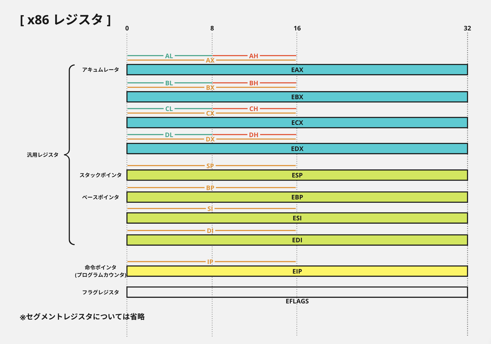
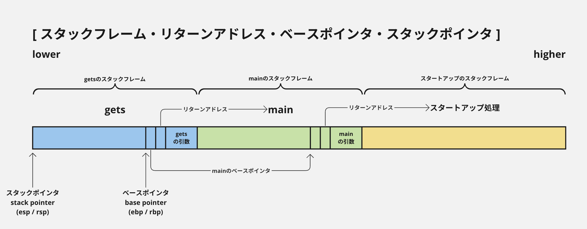
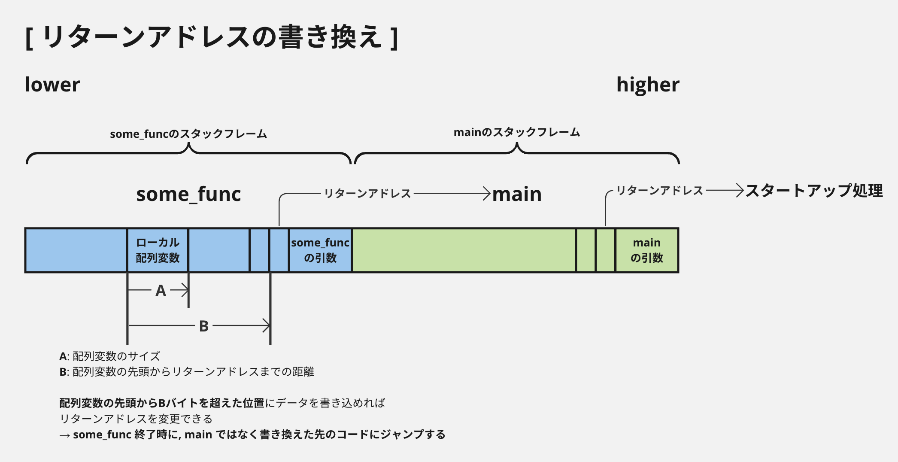
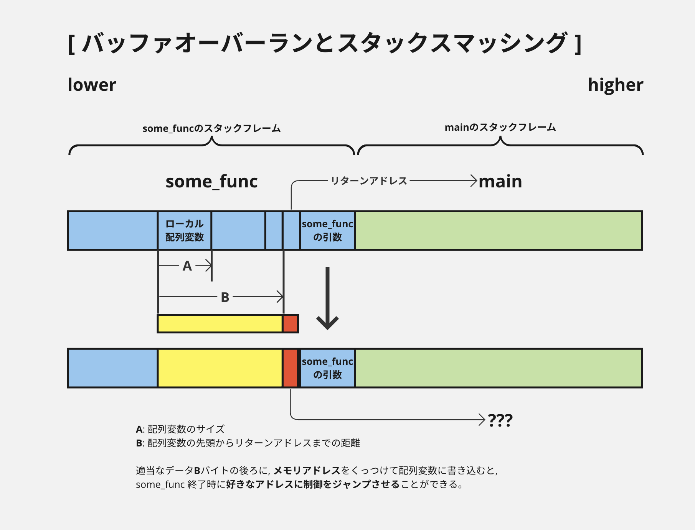
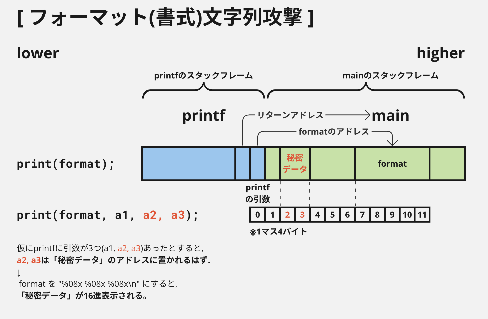
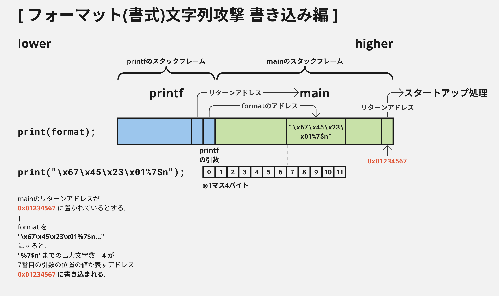

# Over the Rainbow

## このドキュメントについて

42cursusのCTF系課題 Rainfall, Override に挑むにあたり, さしあたって必要と思われる知識をまとめたもの。

## CTF系課題について

2023年10月1日現在, 42Tokyoで常設されているCTF系課題は以下の3つ:

- snow-crash
- **rainfall**
- **override**

(boot2rootなどはセキュリティ系ではあるがCTF系ではないとする)

これら3つのうち, snow-crashはネタの種類が入り乱れているが, rainfallとoverrideに関しては
ほぼ一貫してx86(64)バイナリに対する攻撃が出題される.\
(ただし snow-crash にもバイナリ問題はある)

## Rainfall, Override 課題概要

ひとことで: **「脆弱性を持つバイナリを使って権限昇格を行い, パスワードを抜き取る」**

- 課題ページで Linux の Live CD(のisoイメージ)が配布されているので, Virtual Box などでこれを起動する.
- 10問~ 程度の独立した小問題(レベル)からなる.
- 初期状態で挑戦できるのは最初のレベルだけであり, それを解く(=フラグ文字列を得る)と次のレベルに挑戦できるようになる.
- 各レベルにはそれぞれユーザが対応する.
    - 例: 最初のレベル`level0`には, ユーザ`level0`が対応する.
- 各ユーザがアクセスできる領域は制限されている:
    - ユーザ自身のホームディレクトリ
    - `/tmp`以下
        - 読み書き可能だが, 一覧表示はできない
    - 環境変数`PATH`に含まれる各ディレクトリ
- 各ユーザのホームディレクトリには, ユーザと同名のバイナリが1つだけ置いてある.
    - 例: ユーザ`level0`にログインすると, バイナリ`level0`が置いてある.
- また, `level0`以外のユーザについては, フラグファイル`.pass`も置いてある. これはそのユーザのログインパスワードになっている.
    - 例: ユーザ`level1`のホームディレクトリには`.pass`ファイルがあり, その中身はユーザ`level1`のログインパスワードである.
- このバイナリは「次のレベルのユーザ」に`setuid`されている.
    - 例: バイナリ`level0`はユーザ`level1`に`setuid`されているので, 実行するとユーザ`level1`の権限で動く.
- 各レベルでの最終目的は「次のレベルの`.pass`の中身を知ること」である.


## 全体マップ

- C言語 *このドキュメントの対象外*
- アセンブリ言語
- メモリの構造
- 攻撃手法
- 防御メカニズム
- ツール群


## メモリの構造

`gdb`で, プログラムを起動した状態でコマンド`info proc mappings`を実行すると,
メモリ(仮想アドレス空間)上のどこに何があるのかが表示される.

override の `level00` に対して実際やってみる:\
(`level00`は32ビットバイナリであることに注意)

```
(gdb) info proc mappings
process 3631
Mapped address spaces:

        Start Addr   End Addr       Size     Offset objfile
         0x8048000  0x8049000     0x1000        0x0 /home/users/level00/level00
         0x8049000  0x804a000     0x1000        0x0 /home/users/level00/level00
         0x804a000  0x804b000     0x1000     0x1000 /home/users/level00/level00
        0xf7e2b000 0xf7e2c000     0x1000        0x0 
        0xf7e2c000 0xf7fcc000   0x1a0000        0x0 /lib32/libc-2.15.so
        0xf7fcc000 0xf7fcd000     0x1000   0x1a0000 /lib32/libc-2.15.so
        0xf7fcd000 0xf7fcf000     0x2000   0x1a0000 /lib32/libc-2.15.so
        0xf7fcf000 0xf7fd0000     0x1000   0x1a2000 /lib32/libc-2.15.so
        0xf7fd0000 0xf7fd4000     0x4000        0x0 
        0xf7fd8000 0xf7fdb000     0x3000        0x0 
        0xf7fdb000 0xf7fdc000     0x1000        0x0 [vdso]
        0xf7fdc000 0xf7ffc000    0x20000        0x0 /lib32/ld-2.15.so
        0xf7ffc000 0xf7ffd000     0x1000    0x1f000 /lib32/ld-2.15.so
        0xf7ffd000 0xf7ffe000     0x1000    0x20000 /lib32/ld-2.15.so
        0xfffdd000 0xffffe000    0x21000        0x0 [stack]
(gdb) 
```

表示されている情報を要約すると:

- `level00`のコードがアドレス`0x8048000 ~ 0x804b000`の範囲に展開されている
- libcのコードがアドレス`0xf7e2c000 ~ 0xf7fd0000`に展開されている
- この時点でのスタックは`0xfffdd000 ~ 0xffffe000`に存在する
    - スタックが伸びた場合はさらに範囲が広がる
- アドレス`0xf7fdb000 ~ 0xf7fdc000`に`vdso`という見慣れない文字列があるが, これはシステムコールを高速に呼び出すためのもの

---

ここから何が読み取れるか.\
まず, ユーザプログラム(`level00`)とスタックは遠く離れている.

また今回の例には現れていないが, もしヒープが確保されている場合は, ユーザプログラムの近く(直後)にいるはずである.\
つまりヒープとスタックも遠く離れている.

→ ヒープ上のバッファに対するオーバーランでスタックを書き換える, あるいはその逆を行うのは難しい.

## レジスタとスタック

https://ja.wikibooks.org/wiki/X86%E3%82%A2%E3%82%BB%E3%83%B3%E3%83%96%E3%83%A9/x86%E3%82%A2%E3%83%BC%E3%82%AD%E3%83%86%E3%82%AF%E3%83%81%E3%83%A3




詳しくはwikibooksを読んでもらうとして...

- 同じレジスタに対して, サイズ違いでアクセスする方法がある
    - たとえば, `eax, ax, ah, al`は同じレジスタのそれぞれ異なる部分を指す.
- 課題的に特に重要なのは:
    - `eip`: 「次に実行する命令」のアドレスを保持するレジスタ
    - `ebp, esp`: `ebp`は現在のスタックの底, `esp`はトップのアドレスを持つ.
        - `ebp`とスタックフレームの端が一致しないのがややこしいところ
    - `eax`: 大抵の場合, 関数の戻り値がここに入る

## コールスタック

### スタックにまつわる用語

- スタックフレーム
- リターンアドレス
- ベースポインタ
- スタックポインタ

の4用語について, 互いの関連性を含めてまとめて説明する。



「スタックフレーム」は、スタックのうち特定の関数呼び出しに対応する区間のこと。

「リターンアドレス」は、呼び出されている関数が終了(つまり`return`)した後、
それに続けて実行される命令のアドレス。\
平たく言えば「リターンした後の行き先」。

これら2つは、呼び出されたまま終了していない関数と同じ数だけ存在する。

「スタックポインタ」は, プロセスのアドレス空間において「スタックのトップ」にあたるアドレスを指しているポインタのこと。\
しばしばアドレスそのものも指す。\
x86(x86_64)においては`esp`(`rsp`)レジスタがスタックポインタ。

「ベースポインタ」は, 現在実行されている関数のスタックフレームにおける「スタックの底」を指しているポインタのこと。\
これもしばしばアドレスそのものを意味する。\
x86(x86_64)においては`ebp`(`rbp`)レジスタがスタックポインタ。

### リターンアドレスの書き換えについて

`main`から`some_func`を呼び出している時のスタックの様子:



`some_func`のスタックフレームにおいて, `some_func`からのリターンアドレスはスタックフレームの一番上(アドレスの大きい側)にある。\
一方, `some_func`のローカル変数はスタックフレームの低位側(アドレスの小さい側)にある。

→ あるローカル配列に対して, 配列の長さを超えたところに書き込みができる場合, リターンアドレスを変更できる可能性がある。


### バッファオーバーランとスタックスマッシング



### フォーマット文字列攻撃

`printf`系関数のフォーマット文字列にユーザが干渉できると, かなりデカ目の脆弱性になる。

知りたい情報がprintfのスタックフレームより上(高位側)にある時,\
格納されているアドレス(正確には, printfのベースポインタからの相対位置)さえわかれば,\
`$`による位置指定を使ってその情報を直接表示することができる。




---

この攻撃が真価を発揮するのはデータの書き込み。



フォーマット文字列の長さに十分な余裕があるなら, ほぼ任意のアドレスに対してほぼ任意のデータをピンポイントで書き込むことができる。\
制限事項は:

1. フォーマット文字列の長さが, 書き込みを実現できるほど長いこと
1. 書き込むデータが`INT_MAX`を超えないこと
    - これについては, `%n`で一気に書き込まず, `%hn`で2バイトずつ2回に分けて書き込むことで回避可能.

脆弱性が存在する場合, 書き込み自体を防ぐことは難しい。\
ただし, ASLRにより「書き込み先のアドレス」および「書き込むべきアドレス」を予測しにくくすることはできる。

### return-to-libc 攻撃


### シェルコード

## ツール群

使うツール・コマンドについて。

- [!] x86_64マシン
    - 現状, Apple SiliconマシンではVMを動かすのが極めて困難なため.
- [!] VirtualBox
    - 適当な64ビットLinuxVMを作り, CDドライブに課題のisoイメージをLiveCDとしてセットする.
- [!] `ssh`
    - 起動したVMは直接操作せず, **外部マシンからssh接続して使うことを強く推奨**する.
- [!] `scp`
    - リバースコンパイルするためには, バイナリをVM外に持ち出す必要がある.
- [!] `perl`, `ruby`, `python`: 汎用スクリプト言語
    - 攻撃用データを作るのに使う
- [!] `gdb`: デバッガ
    - ほぼすべての問題で必要
- [!] `objdump`: リバースアセンブラとして使う
- [!] `Ghidra`: リバースコンパイラとして使う
    - すべての問題はとりあえずリバースコンパイルしてみる
    - Apple Silicon環境では追加作業が必要
- アセンブラ
    - シェルコードを自作するときに必要
- `strings`
    - snow-crashでは役に立つが, rainfallまで来るとあんまり
- `nm`
    - 最初にとりあえずやるだけ
- `readelf`
    - あんまり役に立った覚えがない
- `hexdump`
    - 攻撃用データのチェックなどに使う
